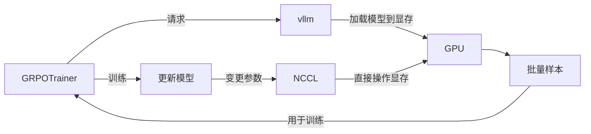

[Open R1](https://github.com/huggingface/open-r1)是huggingface对DeepSeek R1的训练方式的重现。


**因为它兼容huggingface的Transformer框架，功能齐全，代码清晰，很适合作为初步上手的学习项目。**

如果需要生产化的框架可参考 [verl](https://github.com/volcengine/verl) [OpenRLHF](https://github.com/OpenRLHF/OpenRLHF)


# 代码整体

首先open-r1里的代码只是一个调用器，核心的训练逻辑在[trl](https://github.com/huggingface/trl)库中

trl全称是Transformer Reinforcement Learning，在Transformers生态下提供了一系列的训练器Trainer。

**这次主要关注GRPOTrainer**

而open-r1中，则提供了奖励函数、分布式的配置参数与几个模型训练配置项——“菜单”recipes。

我们可以用菜单recipes文件夹中参数来复现open-r1的结果。

另外重点关注奖励函数，因为实践训练模型，需要根据业务调整奖励函数。

# GRPOTrainer
open-r1中GRPOTrainer的入参非常简单
```python
    trainer = GRPOTrainer(
        model=model,
        reward_funcs=reward_funcs,
        args=training_args,
        train_dataset=dataset[script_args.dataset_train_split],
        eval_dataset=dataset[script_args.dataset_test_split] if training_args.eval_strategy != "no" else None,
        peft_config=get_peft_config(model_args),
        callbacks=get_callbacks(training_args, model_args),
        processing_class=tokenizer,
    )
```
### model
参数model是兼容整个Transformer的Model，可以很方便的使用

参数里也有peft config，也能直接用于LoRA的

**可以很简单的将QLoRA用在GRPO的训练器里**

model加载时int4量化，peft里用LoRA config就行

这样在较小的显存空间上，也可以进行微调训练了

### reward_funcs
奖励函数同时支持Transformer的Model以及自定义的奖励计算函数

open r1里提供了如下奖励
```py
REWARD_FUNCS_REGISTRY = {
        "accuracy": accuracy_reward,
        "format": format_reward,
        "reasoning_steps": reasoning_steps_reward,
        "cosine": get_cosine_scaled_reward(
         ...
        ),
        "repetition_penalty": get_repetition_penalty_reward(
           ..
        ),
        "length": len_reward,
        "code": update_wrapper(
          ...
        ),
        "binary_code": update_wrapper(
          ...
        ),
        "ioi_code": update_wrapper(
            partial(ioi_code_reward, test_batch_size=script_args.code_eval_test_batch_size), ioi_code_reward
        ),
        "code_format": get_code_format_reward(language=script_args.code_language),
        "tag_count": tag_count_reward,
    }
    reward_funcs = [REWARD_FUNCS_REGISTRY[func] for func in script_args.reward_funcs]
```

math用的是
```
reward_funcs:
- accuracy 1.0
- format 1.0
- tag_count 1.0
```

ioi的配置用的是
```
reward_funcs:
- ioi_code 1.0
- code_format 0.1
- format 0.1
```

比如数学用的
```py
def accuracy_reward(completions: list[list[dict[str, str]]], solution: list[str], **kwargs) -> list[Optional[float]]:
    contents = [completion[0]["content"] for completion in completions]
```

直接取答案文本content，然后用了

math_verify 库LatexExtractionConfig去parse结果来比较
比如

```
completions = [
    [{"content": "The answer is \boxed{42}"}],  # 模型生成答案1
    [{"content": "x = 10"}],                   # 模型生成答案2（无boxed）
    [{"content": "\boxed{3.14}"}]              # 模型生成答案3
]
solution = ["\boxed{42}", "10", "\boxed{pi}"]  # 标准答案
```

```
[1.0, 0.0, 0.0]  # 答案1正确，答案2错误，答案3错误
```
答案2因为没有加box被判断为错误。


### RepeatSampler
还有个细节是RepeatSampler

它是为了保证多GPU以及扩展梯度时的样本一致性

因为GRPO需要对奖励分数正则化（类似学生最低分到最高分归一化到0-5绩点）。如果题目不同，导致分数差异巨大，这个正则化就失去意义了（指梯度下降前）。

它的解决方式很简单，干脆直接所有GPU都是同一随机序列就行，然后通过合理规制顺序，保证相同prompt在同一组训练就行，这里说同一组就是指梯度下降前（模型参数一致为一组）。

它在代码注释里有比较详细的介绍，

**但这里简单记住它就是通过重复样本保证多GPU固定顺序和相同问题同批出现就行。**
```log
|     Accum step 0      |     Accum step 1      |
|   GPU 0   |   GPU 1   |   GPU 0   |   GPU 1   |
 <-───>  num_generations=2
 <-───────> per_device_train_batch_size=3
 [0   0   1   1   2   2]  3   3   4   4   5   5  
  0   0   1   1   2   2 [ 3   3   4   4   5   5] 
 [0   0   1   1   2   2]  3   3   4   4   5   5  
  0   0   1   1   2   2 [ 3   3   4   4   5   5] 
 [6   6   7   7   8   8]  9   9  10  10  11  11  
  6   6   7   7   8   8 [ 9   9  10  10  11  11] 
```

### 散度loss
beta非0时会触发ref的loss

对应于公式的

$$
\mathbb{D}_{\mathrm{KL}}(\pi_{\theta} \| \pi_{\mathrm{ref}}) = 
\frac{\pi_{\mathrm{ref}}(o_i | q)}{\pi_{\theta}(o_i | q)} 
- \log \frac{\pi_{\mathrm{ref}}(o_i | q)}{\pi_{\theta}(o_i | q)} - 1
$$

它散度kl是根据token去算的

在不给ref_model时，也可以计算loss，直接用的原始模型算的（disable_adapter）

不过如果是sft，而非peft，disable_adapter可能就没用了
```py
if self.beta != 0.0:
    with torch.no_grad():
        if self.ref_model is not None:
            ref_per_token_logps = self._get_per_token_logps(
                self.ref_model, input_ids, attention_mask, logits_to_keep
            )
        else:
            with self.accelerator.unwrap_model(self.model).disable_adapter():
                ref_per_token_logps = self._get_per_token_logps(
                    self.model, input_ids, attention_mask, logits_to_keep
                )
    per_token_kl = (
        torch.exp(ref_per_token_logps - per_token_logps) - (ref_per_token_logps - per_token_logps) - 1
    )
```

### loss_type
open r1 目前提供了3种loss计算方式
```python
if self.loss_type == "grpo":
    loss = ((per_token_loss * completion_mask).sum(-1) / completion_mask.sum(-1).clamp(min=1.0)).mean()
elif self.loss_type == "bnpo":
    loss = (per_token_loss * completion_mask).sum() / completion_mask.sum().clamp(min=1.0)
elif self.loss_type == "dr_grpo":
    loss = (per_token_loss * completion_mask).sum() / (per_token_loss.size(0) * self.max_completion_length)
```
需要注意它实际上和deepseek的grpo的loss计算不完全相同。


# 训练过程
GRPO在训练前，需要通过推理获取样本o

也就是给个问题，尝试多种回答答案。

这一步是在`_prepare_inputs`函数中完成的

Trainer在进行每一步训练时，大体如下步骤
```
_prepare_inputs(batch) 
output = model(**inputs)
loss = compute(**output)
backward(loss.backward)
Optimizer.step()   
Scheduler.step()     
```

GRPOTrainer将生成回答放在了`_prepare_inputs`的`_generate_and_score_completions`里。

在没开启vllm的情况下，它会将模型unwrap（避免分布式的一些问题），然后执行推理。
```python
with unwrap_model_for_generation(
    self.model_wrapped, self.accelerator, gather_deepspeed3_params=self.args.ds3_gather_for_generation
) as unwrapped_model:
    prompt_completion_ids = unwrapped_model.generate(
        prompt_ids, attention_mask=prompt_mask, generation_config=self.generation_config
    )
```

### vllm做推理加速加速
Transformer框架作为训练和实验很好用，但用于推理是远远算不上快的

而在GRPO这个过程中，推理耗时是非常长的，而且往往需要并发推理

而vllm框架正适合这种高吞吐的推理任务。

可vllm并不能修改已加载的模型参数。

trl是通过增加一层vllm-server代理，通过Nvidia GPU的NCCL协议来更新模型参数的。

**等于在vllm加载模型到GPU显存后，trl直接跨过vllm，hack入GPU显存来操作模型参数。**



### 推理优化

扩展来说，GRPO过程中的推理优化是一个很好的切入点。有很多可以优化的点。

比如CoT生成过程中，长短不一致的情况，怎么去避免GPU空闲。明显错误和低分的CoT，比如混合语言，要不要提前中断。还有根据样本场景，是否可以简单题用小模型投机采样来优化。

还有针对小显存环境，可以在推理时卸载模型到CPU内存，避免显存溢出。


