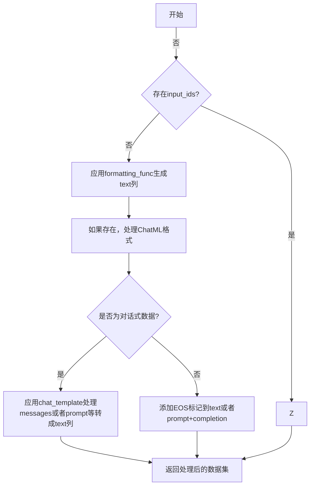

上节完成了数据准备

接下来进行第一步的SFT（监督微调Supervised Fine-Tuning）训练

# 数据预处理
之前有提过，SFT（监督微调Supervised Fine-Tuning）的过程就是模型模仿写作的过程。

**所以理论上只需要一列文本数据就可以**

但有一些隐藏的处理规则，会转换数据集的字段

利用好了这些规则可以比较方便的使用数据集，而不需要自己去做添加special_token（特殊字符，比如EOS表示文字结尾）之类的操作。

```py
# 比如下方代码会自动处理messages列转成text
# trl.trainer.sft_trainer.SFTTrainer._prepare_dataset
...
if is_conversational(first_example):
    ...
    dataset = dataset.map(
        apply_chat_template,
        fn_kwargs={"tokenizer": processing_class},
        remove_columns="messages" if "messages" in column_names else None,  # renamed to "text"
        **map_kwargs,
    )
...
```

转换逻辑可以在`trl.trainer.sft_trainer.SFTTrainer._prepare_dataset`找到

其逻辑大致如下



### chat_ml
chat_ml是OpenAI的一种格式，类似如下json，
```json
{"from": "user", "value": "What color is the sky?"},
{"from": "assistant", "value": "It is blue."}
```
可以在下方列存在
```py
["prompt", "completion", "chosen", "rejected", "messages", "conversations"]
```


### chat_template

chat_template，这个会更好用一些，因为支持tokenizer.apply_chat_template。可以根据每个模型自己的配置去生成相关的special token

通常是如下json
```json
{"role": "system", "content" : "You are...."},
{"role": "user", "content" : "Hi"},
{"role": "assistant", "content" : "Hello, how can I help you today!"}
```

需要的列如下

```python
{"messages"},  # language modeling
{"prompt"},  # prompt-only
{"prompt", "completion"},  # prompt-completion
{"prompt", "chosen", "rejected"},  # preference
{"chosen", "rejected"},  # preference with implicit prompt
{"prompt", "completion", "label"},  # unpaired preference
```

实际可以参考以下表快速决定
| 方法 | ✅推荐 | 💡备注 |
|------|------------|--------|
| `input_ids` 直接输入 | ⚠️ 易犯错 | 仅在模型和 tokenizer 比较特殊时适合 |
| `text` 直接输入 | ✅ 可用 | 需谨慎处理特殊 token，如 padding 等 |
| 使用 `formatting_func` 生成 text | ✅ 可用 | 数据集列较多或需拼接时更灵活 |
| 使用 `messages` 格式 | 🌟 推荐 | 前提是模型支持转换为 chat template |
| 使用 `prompt+completion` | 🌟 推荐 | 经典的 completion 训练方式，易于调试 |

因为我们用的模型支持对话，SFTTrainer也会提取Messages作为训练的input_ids

**只要保证有messages这一列就好**

# 训练配置项
配置项可以参考recipes菜单里的配置项。
```yaml
# recipes/Qwen2.5-1.5B-Instruct/sft/config_demo.yaml
# Model arguments
model_name_or_path: Qwen/Qwen2.5-1.5B-Instruct
model_revision: main
torch_dtype: bfloat16
attn_implementation: flash_attention_2

# Data training arguments
dataset_name: open-r1/OpenR1-Math-220k
...
```

通常来说，只要数据集的格式一致，直接使用就没问题。

**但最好理解配置项的每一项的意义，这样在出现错误时能更快关联问题。**

现在因为GPT的发展，查询配置项的意义功能非常方便。

但是检查错误还是有些困难。比如gradient_checkpointing，它不能与包含中间状态的kvcache混用，因此会在与kvcache相关的peft中报错tensor长度不一致，这样的错误在搜索引擎和ChatGPT都不容易找到原因。

修复就只要将gradient_checkpointing设置为false就能正常工作。（当然我们可以自定义缓存中间状态的kvcache来支持gradient_checkpointing）。

因此不能逃避麻烦，还是得踏踏实实的理清每一项的作用

SFTConfig的实际配置在trl库中
```python
@dataclass
class SFTConfig(TrainingArguments):
```

详细含义都可以在代码Doc中找到。

我在这列出几个可能有影响的配置
### batch_size
```yaml
per_device_eval_batch_size: 4
per_device_train_batch_size: 4
```
这个很基础，按显存支持的容量去配置就好了


### gradient_accumulation_steps 梯队累积
```yaml
gradient_accumulation_steps: 1 # 
```
梯队累积步骤，简单说，执行N次step后做一次backward

原本是写一道题就训练一下，现在写N道题再一起训练。这样可以提升训练的稳定性，不会被特别偏的某一道题给带跑了。

其实batch_size就能起到这个作用，而这个值通常是为了弥补batch_size受限的情况，也就是显存不足的情况。

### gradient_checkpointing 梯队存档
```yaml
gradient_checkpointing: true
gradient_checkpointing_kwargs:
  use_reentrant: false
```
梯队存档，简单说，不存储全部梯度，而是只存储关键梯度，中间梯度到时再算一遍。从而降低显存要求。

use_reentrant是pytorch相关的配置，
reentrant表示可重入，简单说是一个运算能不能重复算。

梯度检查（梯队存档）有2种实现方式，一种是以前autograd引擎的实现方案，另一种应该是基于compile的实现方式。

老的实现方式必须要可重入，因为要重新计算梯度。

新的实现不需要可重入，因为torch.compile会预先规划好图（我没有查到这块详细文档）。

详细可查阅: https://docs.pytorch.org/docs/stable/checkpoint.html

简单说，尽量配置为false，性能更好。如果是老版本的pytorch需要配置为true。


### use_liger_kernel 
```yaml
use_liger_kernel: true
```
[liegr内核](https://github.com/linkedin/Liger-Kernel)是用于 LLM 训练的高效 Triton 内核。

可以提速和提吞吐，降低显存使用率。（文档称qwen模型吞吐量提高了约10%，而GPU内存使用率下降了50%）

要注意只有有限的模型可以直接支持Liger（因为Transformer已经写好了支持），一些自定义的模型需要参考repo里的说明支持liger。或者设置为false去跑。


# 训练性能优化
与下一节的GRPO过程不同，SFT是偏向计算消耗型。

因为所有的token都在同一时间给了模型。

这一块的工程调优都比较扎实了。**无论是分布式还是单机都有比较好的解决方案**，可以最大限度的利用完GPU的资源。

ddp fsdp zero2 zero3等加速框架的配置项在repo中也有例子给出，按照实际情况修改即可。

不使用加速框架的话需要注意一下显存溢出

除了上面配置项里与显存优化相关的选项和batchsize，还有注意数据集的样本长度，检查是否有极端长的样本。极端长样本可能会导致input显存突增。会让SFT运行到一半就OOM。


# 总结

在执行SFT（监督微调Supervised Fine-Tuning）时，要将已准备的数据集配置为正确的列格式。

| 方法 | 推荐 | 备注💡 |
|------|------------|--------|
| `input_ids` | ⚠️  | 仅在模型和 tokenizer 比较特殊时适合 |
| `text` | ✅  | 需谨慎处理特殊 token，如 padding 等 |
| `formatting_func` | ✅  | 数据集列较多或需拼接时更灵活 |
| `messages` | 🌟  | 前提是模型支持转换为 chat template |
| `prompt+completion` | 🌟  | 经典的 completion 训练方式，易于调试 |

此外需要注意训练配置参数里的一些关键项，理解每一项的含义，以便出错时定位问题。

常用的训练优化提速方法，比如ddp、fsdp和zero在代码里都有例子。

如果直接跑代码的话就要注意一下OOM的问题。

